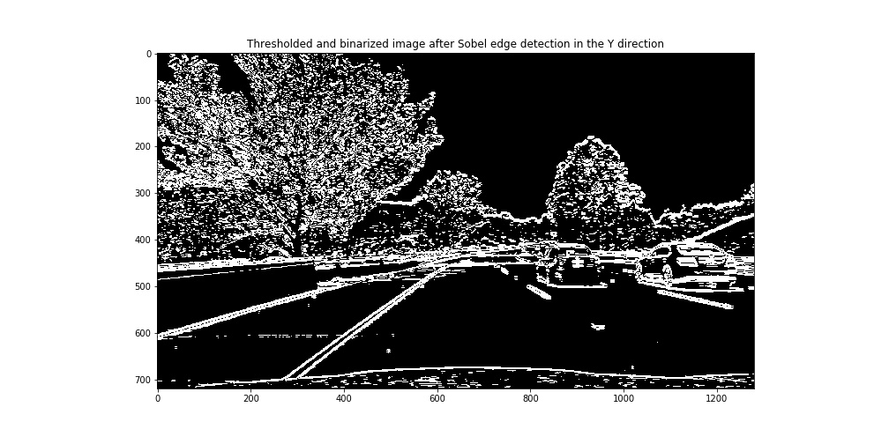

## Advanced Lane Finding Project

---
The goals / steps of this project are the following:

* Compute the camera calibration matrix and distortion coefficients given a set of chessboard images.
* Apply a distortion correction to raw images.
* Use color transforms, gradients, etc., to create a thresholded binary image.
* Apply a perspective transform to rectify binary image ("birds-eye view").
* Detect lane pixels and fit to find the lane boundary.
* Determine the curvature of the lane and vehicle position with respect to center.
* Warp the detected lane boundaries back onto the original image.
* Output visual display of the lane boundaries and numerical estimation of lane curvature and vehicle position.

**Note:** Any code discussed in the following sections can be found in the accompanying p4_advanced_lane_finding.ipynb Jupyter Notebook under a section annotated with the same section number.

[//]: # (Image References)

[image1]: ./examples/undistort_output.png "Undistorted"
[image2]: ./test_images/test1.jpg "Road Transformed"
[image3]: ./examples/binary_combo_example.jpg "Binary Example"
[image4]: ./examples/warped_straight_lines.jpg "Warp Example"
[image5]: ./examples/color_fit_lines.jpg "Fit Visual"
[image6]: ./examples/example_output.jpg "Output"
[video1]: ./project_video.mp4 "Video"

## [Rubric](https://review.udacity.com/#!/rubrics/571/view) Points

### Here I will consider the rubric points individually and describe how I addressed each point in my implementation.  

---

### A. Writeup / README

#### A.1. Provide a Writeup / README that includes all the rubric points and how you addressed each one.  You can submit your writeup as markdown or pdf.  [Here](https://github.com/udacity/CarND-Advanced-Lane-Lines/blob/master/writeup_template.md) is a template writeup for this project you can use as a guide and a starting point.  

You're reading it!

### B. Camera Calibration

#### B.1. Briefly state how you computed the camera matrix and distortion coefficients. Provide an example of a distortion corrected calibration image.

I am using the `calibrateCamera()` function from the `cv2` module for computing the camera distortion matrices from a series of chessboard images. This function takes a series of idealized "object points" which represent the (x, y, z) coordinates of the chessboard corners in a simplified coordinate system along with corresponding coordinates from the real world (computed using the `cv2.findChessboardCorners()` function).

Here I am assuming the chessboard is fixed on the (x, y) plane at z=0, such that the object points are the same for each calibration image.  Thus, `objp` is just a replicated array of coordinates, and `objpoints` will be appended with a copy of it every time I successfully detect all chessboard corners in a test image.  `imgpoints` will be appended with the (x, y) pixel position of each of the corners in the image plane with each successful chessboard detection (using `cv2.findChessboardCorners()`).

Note `cv2.findChessboardCorners()` will only succeed if the chessboard dimension passed to it matches exactly with the number of corners visible in the image. And since some of these images have a different number of visible chessboard corners I run the detection using a set of two dimension pairs. That is I first try detecting corners assuming the chessboard has (9, 6) corners and if this fails then I retry with (9, 5) corners. This lets me use some images which I would have had to discard otherwise. The calibration code is designed to report/show the images for which the `findChessboardCorners()` procedure failed.

Finally I applied this distortion correction to the test image using the `cv2.undistort()` function and obtained the result as shown below.

### C. Pipeline (individual images)

#### C.1. Provide an example of a distortion-corrected image.

To demonstrate this step, I will I apply distortion correction to one of the test images (shown below) using the distortion coefficients calculated in the camera calibration step and the cv2.undistort() function.

#### C.2. Describe how (and identify where in your code) you used color transforms, gradients or other methods to create a thresholded binary image.  Provide an example of a binary image result.

I used a combination of color and gradient thresholds to generate a binary image. I chose the thresholds to best highlight the lane line pixels while rejecting other objects in the scene.

I converted the distortion corrected input image to ...

1. A grayscale image and 
2. HLS color space image and extracted just the Saturation plane from it

and processed these 2D matrices using the following thresholding and binarization pipeline...

1. Calculate the Sobel matrix in the x and y directions and then use them to derive a matrix containing their magnitude...

2. Calculate the direction of the gradient of the X and Y Sobel matrices and remove any gradients from it which do not fall within the angles of 30 and 45 degrees.

I then combined these matrices to produce a unified thresholded and binarized image. Here's an example of my output from this part of the pipeline...

#### C.3. Describe how (and identify where in your code) you performed a perspective transform and provide an example of a transformed image.

The `get_prespective_matrix_and_src_coords()` function returns the perspective transform matrices calculated using hardcoded source coordinates and trignometrically derived destination coordinates. It uses the `cv2.getPerspectiveTransform()` function to calculate these matrices.

This resulted in the following source and destination points:

| Source        | Destination   | 
|:-------------:|:-------------:| 
| 206, 719      | 206, 719      | 
| 579, 462      | 206, 267      |
| 704, 462      | 1103, 267     |
| 1103, 719     | 1103, 267     |

I used `cv2.warpPerspective()` to apply the perspective transform matrix to an image in `apply_perspective_transform()`.

I verified that my perspective transform was working as expected by drawing the `src` and `dst` points onto a test image and its warped counterpart to verify that the lines appear parallel in the warped image.

I also tested the inverse perspective transform matrix using `apply_perspective_transform()` and here is the output...

#### C.4. Describe how (and identify where in your code) you identified lane-line pixels and fit their positions with a polynomial?

Here are the steps I took to identify the lane pixels and fit their positions with a polynomial...

1. Distortion corrected, thresholded and binarized the input image as described in previous sections.
2. Applied a bird's eye view perspective transform to the image obtained in step 1 as per section C.3. Note applying the perspective transform after thresholding (instead of before) minimizes the noise due to image blurring caused by `cv2.warpPerspective()`.
3. Perform lane detection on the warped thresholded image using the following steps...
4. Obtain a histogram by summing the pixel values of the columns in the lower half of the image obtained in step 3. The peaks of this histogram can be used as a starting point for detecting the lane-line pixels.
5. Use sliding windows placed around the peaks detected above to find and follow the lines up to the top of the frame. See `detect_lane_boundaries()` for more information.
6. Step through the windows one by one and identify the nonzero pixels within the window and append these indices to the list of pixels for the given lane.
8. If we have discovered more than a certain minimum number of pixels in a window we recenter next window on their mean position. The next window is placed directly above the current window in any case.
9. Once the lane pixels have been identified use `np.polyfit()` to fit a second degree polynomial curve through them. This will yield one coefficient array for each second degree equation (corresponding the left and right lanes) which can then be used to annotate the lane.

#### C.5. Describe how (and identify where in your code) you calculated the radius of curvature of the lane and the position of the vehicle with respect to center.

The radius of curvature is calculated in `get_radius_of_curvature()`. This function takes the lane line pixel positions identified in the previous stage and scales them to move them into real world coordinates where each pixel position is located using real world units. Now `np.polyfit()` is used again to fit a second degree equation through these pixels. We now get coefficients which represent a second degree curve in the real world coordinate system. We then apply the radius of the curve equation using these coefficients and coordinates to get the radius of the curvature for each lane (in meters).

The position of the vehicle with respect to center is calculated in `get_center_offset()`. This function first calculates the center of the lane at the bottom of the image using the lane pixels identified previously. It then subtracts the x-coordinate of the center of the image from the center of the lane to determine the vehicle offset with respect to the lane center in pixels. This offset in pixels is then scaled by an appropriate factor to obtain an offset in real world units.

#### C.6. Provide an example image of your result plotted back down onto the road such that the lane area is identified clearly.

Here is an example of my result on a test image:

---

### D. Pipeline (video)

#### D.1. Provide a link to your final video output.  Your pipeline should perform reasonably well on the entire project video (wobbly lines are ok but no catastrophic failures that would cause the car to drive off the road!).

Here's a [link to my video result](./output_videos/project_video_annotated.mp4)

---

### E. Discussion

#### E.1. Briefly discuss any problems / issues you faced in your implementation of this project. Where will your pipeline likely fail?  What could you do to make it more robust?

##### Problems and issues faced
1. Not all camera calibration images have 9x6 corners some only have 9x5 corners visible and some others have even fewer. So I reran `cv2.findChessboardCorners()` again with 9x5 corners when I failed to make it work with 9x6 corners. 

2. Coming up with good source coordinates for the bird's eye view perspective transform was difficult since I got blurred results if I covered too much area. So I used the interact() function from the IPython library to setup an interactive environment to fine tune these coordinates manually.

##### Possible failure modes and ideas for avoiding them.
1. I use a grayscale image and the saturation channel from the HSL image for detecting the lane pixels but this does not work very well in abnormal light conditions. Other color spaces and techniques should be explored to make lane pixel detection more robust under suboptimal lighting.
2. Using np.plolyfit() to fit a second degree curve through the lane pixels doesn't always give the best lane marker since the sobel edge detection phase tends to transform a single lane line into two lines separated by a gap. And these two lines do not always have the same number of pixels. Explore some option where this does not happen or somehow use the gap between these two lines to fit the curves.
3. Add sanity checks after lane detection to reject false positives.
